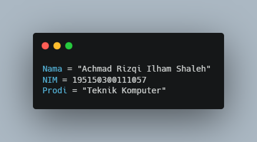
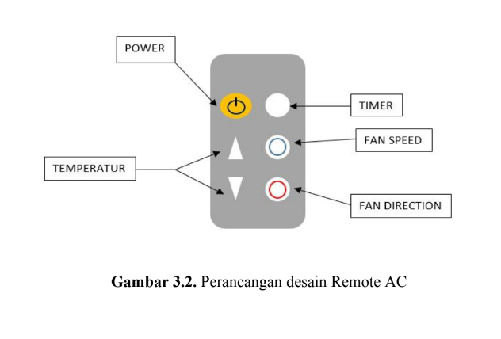
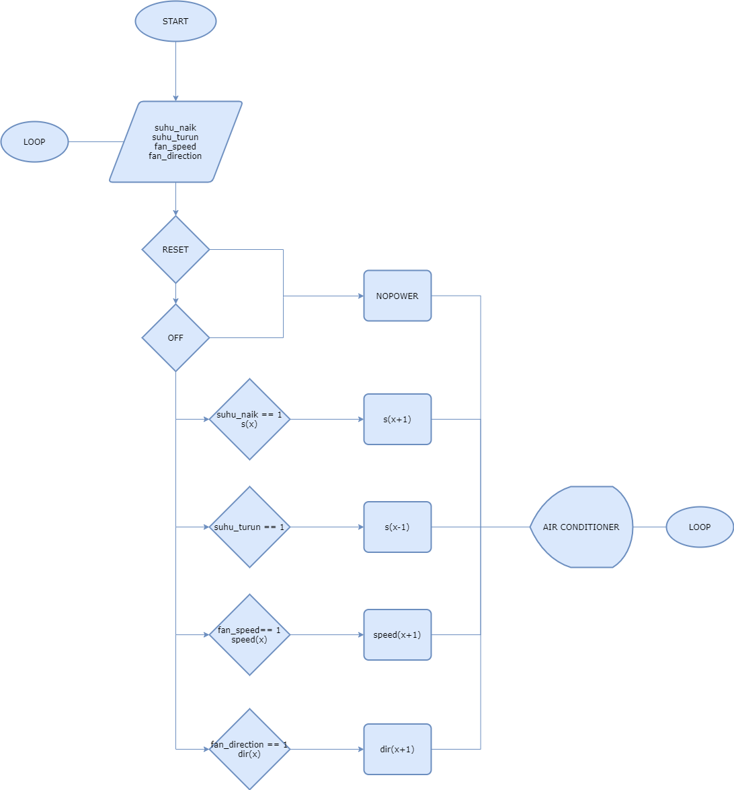
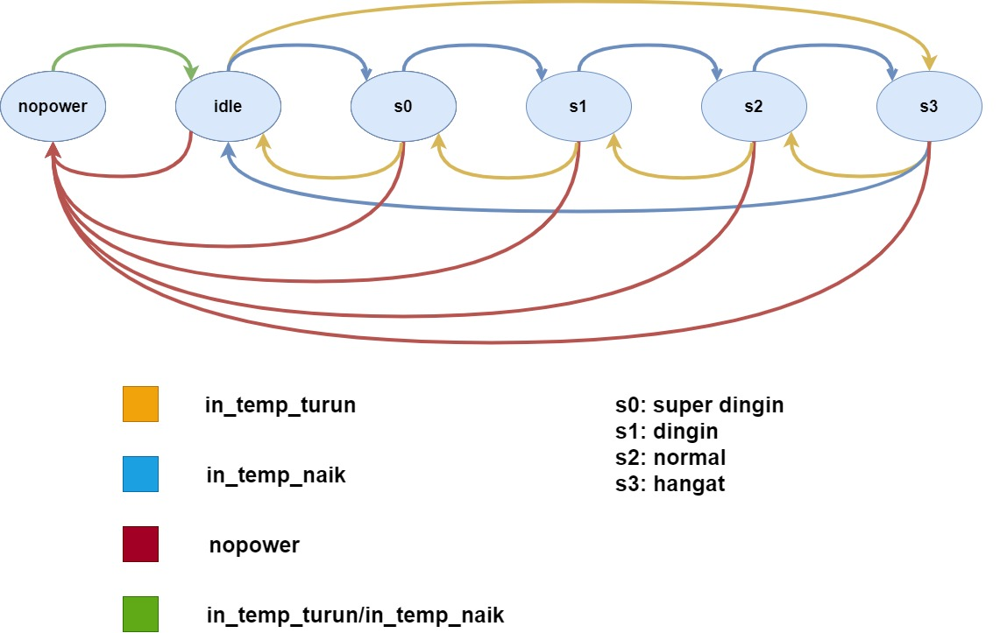

# AC_Remote_FPGA_Programming
This repository is created to archive the last assignment for FPGA Programming class Prodi Teknik Komputer Fakultas Ilmu Komputer Universitas Brawijaya. A VHDL Project based on Spartan-3E Starter Board that developed in Xilinx - ISE Design Suite Project Navigator 14.7.

#Credit:

## Main Source Code
Click [Here.](sourcecode/AC_Remote.vhd)

## System Overview

### 1. Button Mapping

### 2. System FLowchart

### 3. UCF Constraints

### 4. Timing Constraints

### 5. Simulation Results (ISim)

